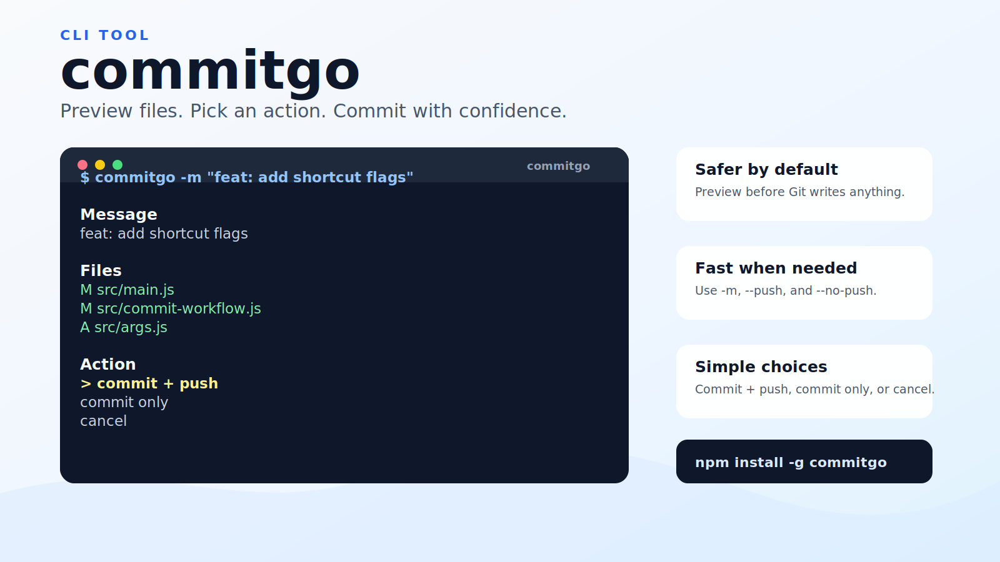

# commitgo

commitgo is a small CLI tool for people who want to commit safely without typing the same Git commands every time.

It checks your repository, validates the commit message, previews changed files, and lets you choose whether to push.



## Features

- Preview changed files before committing
- Validate commit messages with Conventional Commits
- Choose between commit + push, commit only, or cancel
- Use keyboard selection in an interactive terminal
- Use shortcut flags for faster commits
- Pass commit messages safely without shell string interpolation

## Install

```bash
npm install -g commitgo
```

or:

```bash
pnpm install -g commitgo
```

## Usage

Run commitgo in a Git repository:

```bash
commitgo
```

You will be asked for a commit message, then commitgo will show the files that are about to be committed.

```text
commitgo

Types: feat, fix, docs, release, style, workflow, types, ci, revert, wip, build, perf, dx, chore, refactor, test
Format: type(scope): message

Message:
  > feat: add shortcut flags

Message
  feat: add shortcut flags

Files
  M  src/main.js
  M  src/commit-workflow.js
  A  src/args.js

Action
  > commit + push
    commit only
    cancel
```

## Shortcut Flags

Skip the message prompt:

```bash
commitgo -m "feat: add shortcut flags"
```

Commit without pushing:

```bash
commitgo -m "feat: add shortcut flags" --no-push
```

Commit and push directly:

```bash
commitgo --message "fix: push safely" --push
```

## Commit Message Format

commitgo accepts these commit types:

```text
feat, fix, docs, release, style, workflow, types, ci, revert, wip, build, perf, dx, chore, refactor, test
```

Examples:

```bash
feat: add shortcut flags
fix(cli): handle invalid action
docs: rewrite readme
```

## Requirements

- Node.js 14 or newer
- Git
- A Git repository with a remote configured if you want to push

## Development

```bash
pnpm install
pnpm test
```

## License

ISC
